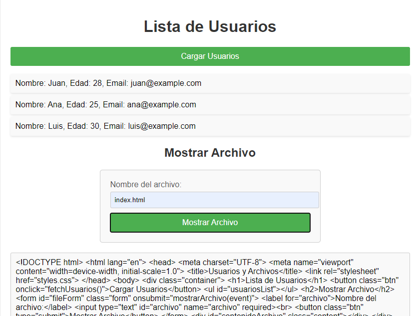
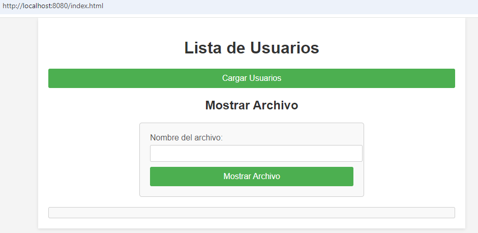
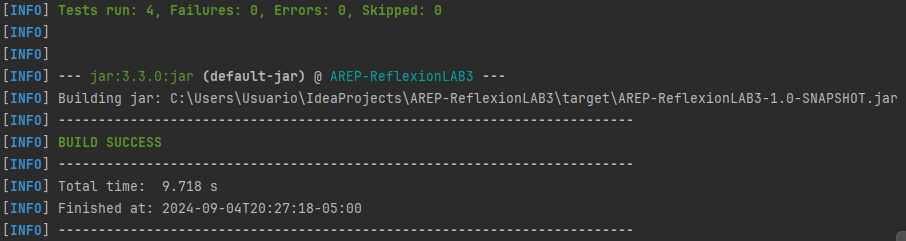
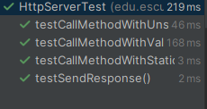

# AREP-ReflexionLAB3

Este proyecto proporciona la implementación de un servidor web HTTP el cual maneja contenido estático 
y dinámico por medio de un marco REST. El marco utiliza anotaciones personalizadas para asignar solicitudes 
y parámetros HTTP GET a métodos en clases de controlador.

 

## Instalación

### Requisitos

- Java JDK 17 o superior
- Apache Maven (opcional, para gestionar dependencias)

### Instalación

Para usar el programa en el sistema puede usar el siguiente comando para clonar 
los archivos.

```
git clone https://github.com/Richi025/AREP-ReflexionLAB3.git 
```

Una vez que ya se haya clonado el proyecto, siga los siguientes pasos para lanzar el programa.

1. Abrir el terminal e ingresar a la carpeta del repositorio clonado.

2. Usar el siguiente comando para limpiar y compilar la carpeta target.
      ```
      mvn clean package
      ```
3. Ahora ya puede correr el proyecto con este último comando.

      ```
      java -jar .\target\AREP-ReflexionLAB3-1.0-SNAPSHOT.jar 
      ```

5. Cuando el progrma ya este iniciado, abrimos el browser e ingresamos las URLs.


* http://localhost:8080/index.html

 

* http://localhost:8080/google.jpg

 


## Correr los tests

Para correr los test usamos el siguiente comando.

```
mvn test
```





### Descripción de los Tests

1. **`testCallMethodWithValidQueryParams`:**
    - Verifica que el método `callMethod` maneje correctamente una solicitud GET con parámetros de consulta válidos. En este caso, se envía la solicitud a la ruta `/App/leerArchivos?name=John`, y se espera que la respuesta incluya un mensaje en formato HTML que diga "Hello, John". También se verifica que la respuesta tenga un código HTTP 200 (OK) y un `Content-Type: text/html`.

2. **`testCallMethodWithStaticFile`:**
    - Comprueba que el servidor pueda servir correctamente un archivo estático (`index.html`). Envía una solicitud GET a la ruta `/index.html`, y valida que el servidor responda con un código HTTP 200 (OK) y un `Content-Type: text/html`, confirmando que el archivo estático se sirvió correctamente.

3. **`testCallMethodWithUnsupportedMethod`:**
    - Asegura que el servidor maneja correctamente solicitudes con métodos HTTP no permitidos. En este caso, se envía una solicitud POST a la ruta `/App/leerArchivos`, que solo permite GET, y se verifica que la respuesta tenga un código HTTP 405 (Método No Permitido) y un mensaje explicando que el método no está permitido.

4. **`testSendResponse`:**
    - Verifica que el método `sendResponse` del servidor construya correctamente una respuesta HTTP con un código de estado, tipo de contenido y cuerpo específico. En este caso, se espera que el servidor envíe una respuesta con código HTTP 200 (OK), `Content-Type: text/plain`, y un mensaje "Hello" con una longitud de 5 bytes.

    
### Componentes

+ **Cliente**: El browser del cliente envía peticiones HTTP GET por medio de un socket.

+ **Servidor**:
  - El servidor escucha por medio del puerto 8080.
  - Las peticiones las maneja el `HttpServer`, el cual distribuye las peticiones entre los controladores o maneja los archivos estáticos.
  - El servidor también provee archivos estáticos desde el directorio `public`.

+ **Anotaciones**:
  - Las clases `HelloService` y `RestServices` están anotadas con `@RestController`, y los métodoas están unidas con rutas usando `@GetMapping` y parámetros por medio de `@RequestParam`.


### Explicación de Componentes

+ **HttpServer**
  - La clase principal que maneja las conexiones entrantes, registrar controladores, y sus metódos. Escucha por el puerto 8080 y maneja por medio de controladores peticiones estáticas y dinámicas.

+ **HelloService** and **RestServices**
  - Clases controlador anotadas con `@RestController`, cada una maneja peticiones HTTP GET para rutas específicas `/Hello` and `/App/usuarios`. Proveen funcionalidades dinámicas tales como generar mensajes de saludo o retornar una lista de usuarios.

+ **Annotations**
  - **@GetMapping**: Anotación usada para mapear rutas HTTP GET para metódos específicos dentro de los controladores.
  - **@RequestParam**: Anotación que une parámetros de peticiones HTTP a parámetros de metódos, permitiendo valores desde la URL para ser pasado en metódos.
  - **@RestController**: Anotación que indica que una clase es un REST controller, capaz de manejar peticiones HTTP y generar respuestas en formatos como JSON o texto plano.

## Construido con

* [Maven](https://maven.apache.org/) - Dependency management
* [java](https://www.java.com/es/) - Programming language

## Versionado

Se uso [Git](https://github.com/) para control de versiones.

## Fecha

Wednesday, September 04, 2024
